# [📈 Live Status](https://MitichPavel.github.io/eb24-status): <!--live status--> **🟧 Partial outage**

This repository contains the open-source uptime monitor and status page for [Eloboost24 status](https://MitichPavel.github.io/eb24-status), powered by [Upptime](https://github.com/upptime/upptime).

With [Upptime](https://upptime.js.org), you can get your own unlimited and free uptime monitor and status page, powered entirely by a GitHub repository. We use [Issues](https://github.com/MitichPavel/eb24-status/issues) as incident reports, [Actions](https://github.com/MitichPavel/eb24-status/actions) as uptime monitors, and [Pages](https://MitichPavel.github.io/eb24-status) for the status page.

---

## 📊 Troubleshooting Failures (Playwright Tracing)

When the automated `E2E Purchase Flow` monitor fails, the system does not produce raw text files or flat static screenshots. Instead, it exports a fully fledged, comprehensive **Playwright Trace Report**.

### Where can I find the failure reports?

1. Go to the **Actions** tab in your GitHub repository.
2. Click on the latest failed (red) workflow execution run.
3. Scroll down to the **Artifacts** section or view the **Job Summary** section.
4. Download the file named `playwright-trace-report` (it will be downloaded as a `.zip` package, e.g., `playwright-trace-accounts.zip`).

### How to open and explore the report?

Trace files are deeply optimized binary packages and cannot be inspected with a default local double-click.

1. Open your web browser and go to the official inspector: **[trace.playwright.dev](https://trace.playwright.dev/)**
2. Drag and drop the downloaded `.zip` file anywhere onto that page.
3. **Done! You now have full access to a local debugger of the bot's session:**
   - **Timeline:** Hover over any millisecond of the execution to view live screen snapshots.
   - **Actions/Screenshots:** Inspect mouse clicks, focused DOM nodes, and the current layout state.
   - **Network Tab:** View exact HTTP/API requests and responses (including headers and backend response bodies).
   - **Console Logs:** Review evaluation warnings, network blocks, or runtime exceptions.

<!--start: status pages-->
<!-- This summary is generated by Upptime (https://github.com/upptime/upptime) -->
<!-- Do not edit this manually, your changes will be overwritten -->
<!-- prettier-ignore -->
| URL | Status | History | Response Time | Uptime |
| --- | ------ | ------- | ------------- | ------ |
|  [Homepage](https://eloboost24.eu) | 🟩 Up | [homepage.yml](https://github.com/MitichPavel/eb24-status/commits/HEAD/history/homepage.yml) | 

 1108ms
     
 | 

<a href="https://MitichPavel.github.io/eb24-status/history/homepage">100.00%</a>
    

|  [Accounts LOL Accounts](https://eloboost24.eu/marketplace/accounts/league-of-legends) | 🟩 Up | [accounts-lol-accounts.yml](https://github.com/MitichPavel/eb24-status/commits/HEAD/history/accounts-lol-accounts.yml) | 

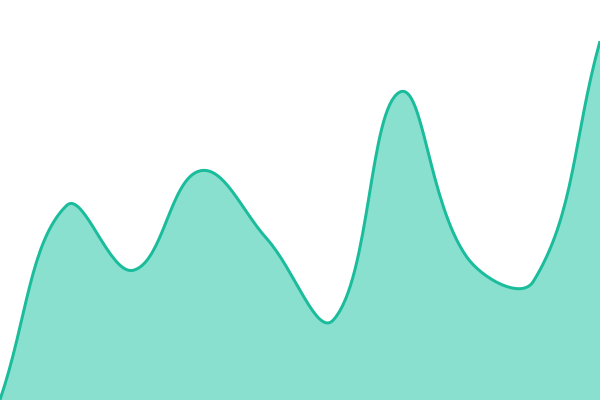 909ms
     
 | 

<a href="https://MitichPavel.github.io/eb24-status/history/accounts-lol-accounts">100.00%</a>
    

|  [Items LOL Items](https://eloboost24.eu/marketplace/items/league-of-legends) | 🟩 Up | [items-lol-items.yml](https://github.com/MitichPavel/eb24-status/commits/HEAD/history/items-lol-items.yml) | 

 917ms
     
 | 

<a href="https://MitichPavel.github.io/eb24-status/history/items-lol-items">100.00%</a>
    

|  [Coaching LOL](https://eloboost24.eu/coaching/league-of-legends) | 🟩 Up | [coaching-lol.yml](https://github.com/MitichPavel/eb24-status/commits/HEAD/history/coaching-lol.yml) | 

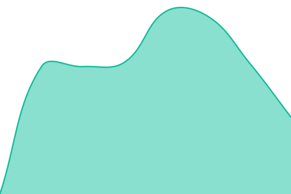 845ms
     
 | 

<a href="https://MitichPavel.github.io/eb24-status/history/coaching-lol">100.00%</a>
    

|  [GGirls LOL](https://eloboost24.eu/ggirls/league-of-legends) | 🟩 Up | [g-girls-lol.yml](https://github.com/MitichPavel/eb24-status/commits/HEAD/history/g-girls-lol.yml) | 

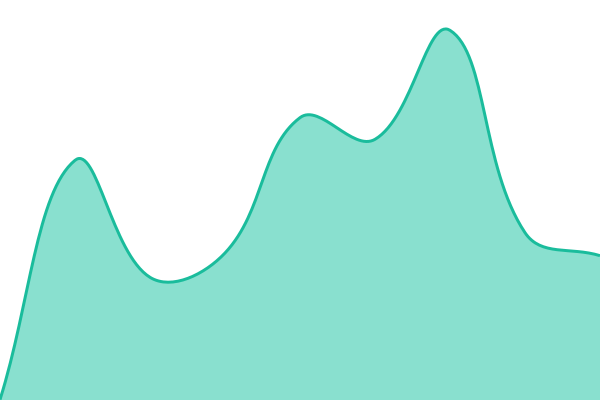 748ms
     
 | 

<a href="https://MitichPavel.github.io/eb24-status/history/g-girls-lol">100.00%</a>
    

|  [Boosting LOL Swift Pass](https://eloboost24.eu/boosting/swift-pass) | 🟩 Up | [boosting-lol-swift-pass.yml](https://github.com/MitichPavel/eb24-status/commits/HEAD/history/boosting-lol-swift-pass.yml) | 

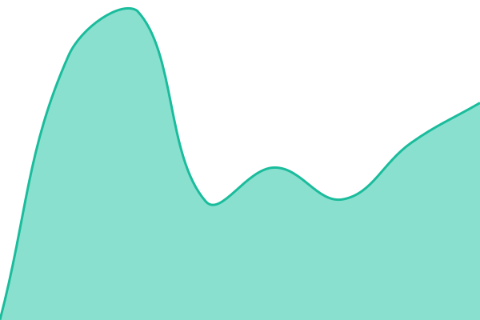 931ms
     
 | 

<a href="https://MitichPavel.github.io/eb24-status/history/boosting-lol-swift-pass">100.00%</a>
    

|  [Pro Games LOL](https://eloboost24.eu/pro-games/league-of-legends) | 🟩 Up | [pro-games-lol.yml](https://github.com/MitichPavel/eb24-status/commits/HEAD/history/pro-games-lol.yml) | 

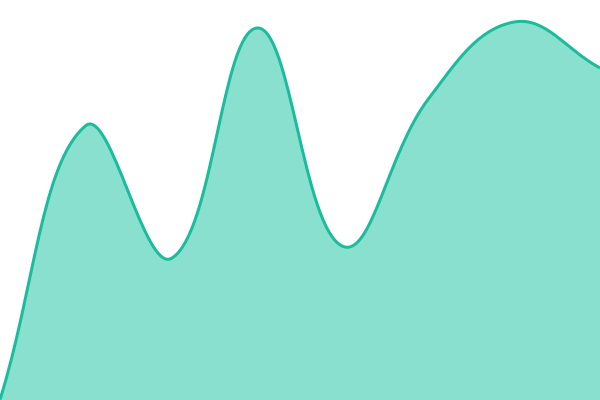 724ms
     
 | 

<a href="https://MitichPavel.github.io/eb24-status/history/pro-games-lol">100.00%</a>
    

|  [Blog](https://eloboost24.eu/blog) | 🟩 Up | [blog.yml](https://github.com/MitichPavel/eb24-status/commits/HEAD/history/blog.yml) | 

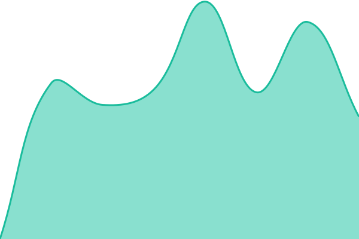 1049ms
     
 | 

<a href="https://MitichPavel.github.io/eb24-status/history/blog">100.00%</a>
    

|  [Purchase: Boosting Flow](https://raw.githubusercontent.com/MitichPavel/eb24-status/master/status-data/boosting.html) | 🟩 Up | [purchase-boosting-flow.yml](https://github.com/MitichPavel/eb24-status/commits/HEAD/history/purchase-boosting-flow.yml) | 

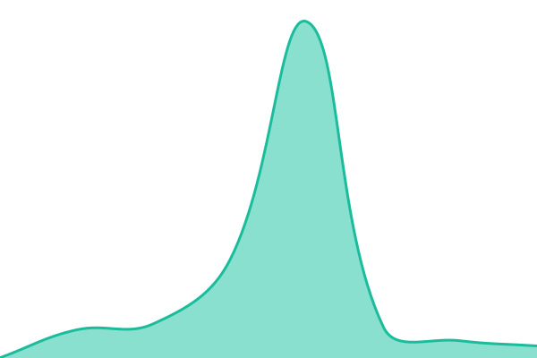 140ms
     
 | 

<a href="https://MitichPavel.github.io/eb24-status/history/purchase-boosting-flow">100.00%</a>
    

|  [Purchase: Coaching Flow](https://raw.githubusercontent.com/MitichPavel/eb24-status/master/status-data/coaching.html) | 🟩 Up | [purchase-coaching-flow.yml](https://github.com/MitichPavel/eb24-status/commits/HEAD/history/purchase-coaching-flow.yml) | 

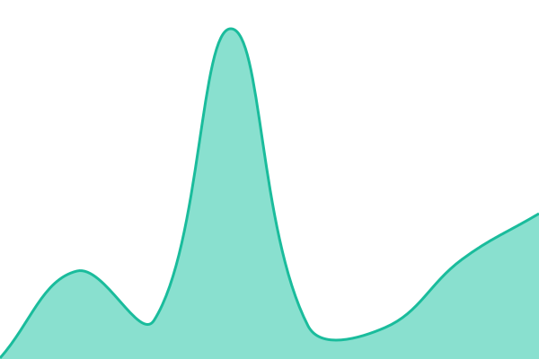 107ms
     
 | 

<a href="https://MitichPavel.github.io/eb24-status/history/purchase-coaching-flow">97.29%</a>
    

|  [Purchase: Accounts Flow](https://raw.githubusercontent.com/MitichPavel/eb24-status/master/status-data/accounts.html) | 🟩 Up | [purchase-accounts-flow.yml](https://github.com/MitichPavel/eb24-status/commits/HEAD/history/purchase-accounts-flow.yml) | 

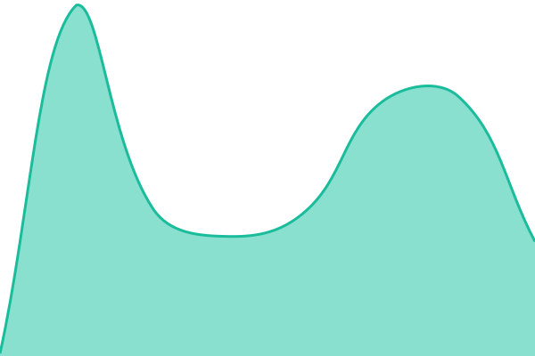 139ms
     
 | 

<a href="https://MitichPavel.github.io/eb24-status/history/purchase-accounts-flow">90.29%</a>
    

|  [Purchase: Items Flow](https://raw.githubusercontent.com/MitichPavel/eb24-status/master/status-data/items.html) | 🟩 Up | [purchase-items-flow.yml](https://github.com/MitichPavel/eb24-status/commits/HEAD/history/purchase-items-flow.yml) | 

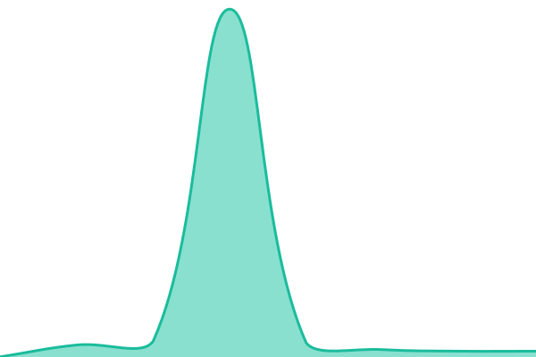 119ms
     
 | 

<a href="https://MitichPavel.github.io/eb24-status/history/purchase-items-flow">99.36%</a>
    

|  [Purchase: GGirls Flow](https://raw.githubusercontent.com/MitichPavel/eb24-status/master/status-data/ggirls.html) | 🟩 Up | [purchase-g-girls-flow.yml](https://github.com/MitichPavel/eb24-status/commits/HEAD/history/purchase-g-girls-flow.yml) | 

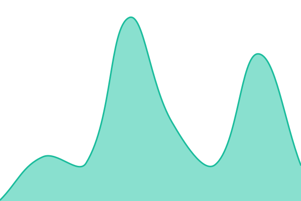 117ms
     
 | 

<a href="https://MitichPavel.github.io/eb24-status/history/purchase-g-girls-flow">99.36%</a>
    

|  [Purchase: Pro Games Flow](https://raw.githubusercontent.com/MitichPavel/eb24-status/master/status-data/progames.html) | 🟥 Down | [purchase-pro-games-flow.yml](https://github.com/MitichPavel/eb24-status/commits/HEAD/history/purchase-pro-games-flow.yml) | 

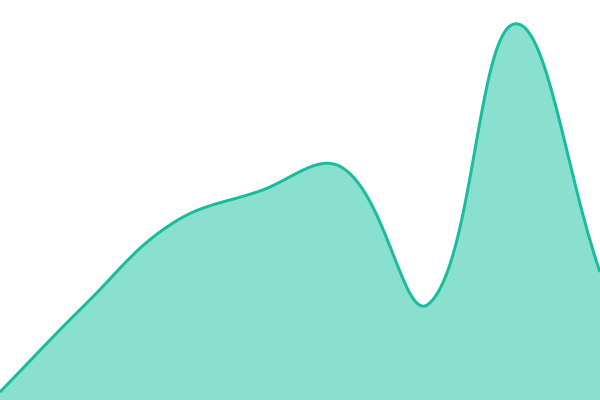 82ms
     
 | 

<a href="https://MitichPavel.github.io/eb24-status/history/purchase-pro-games-flow">48.00%</a>
    

<!--end: status pages-->

[**Visit our status website →**](https://MitichPavel.github.io/eb24-status)

## 📄 License

- Powered by: [Upptime](https://github.com/upptime/upptime)
- Code: [MIT](./LICENSE) © [Anand Chowdhary](https://anandchowdhary.com)
- Data in the `./history` directory: [Open Database License](https://opendatacommons.org/licenses/odbl/1-0/)
